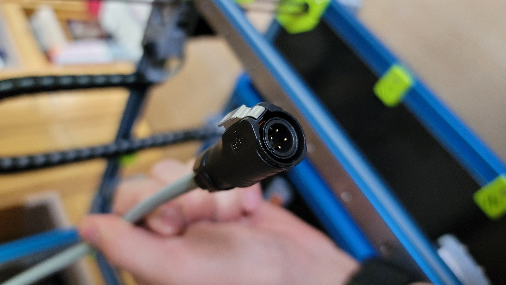
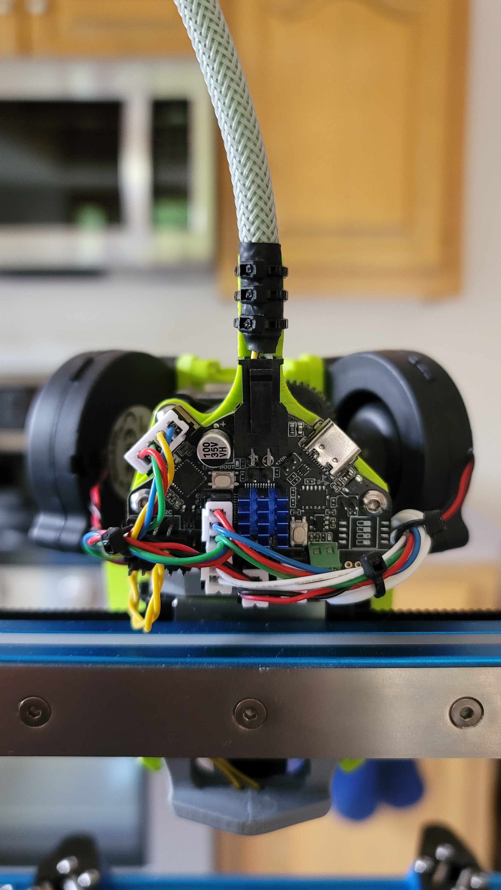
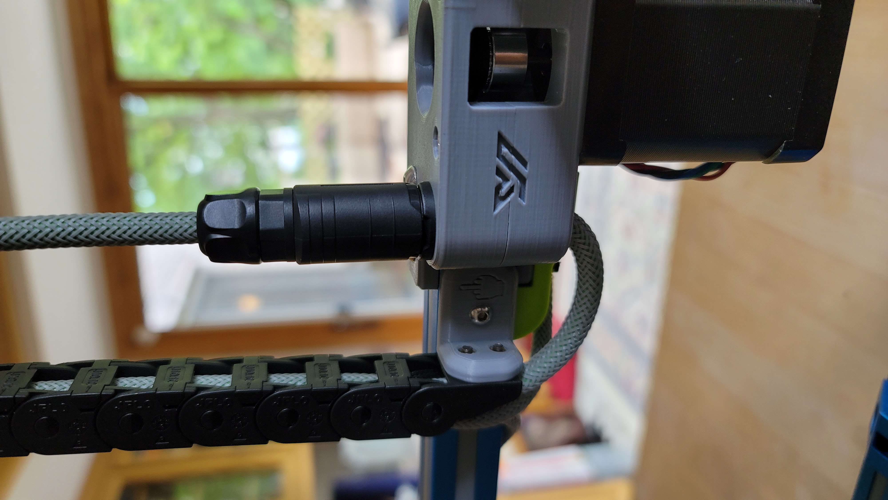

# Voron V2.4 Pinned A/B Drive w/ PG7 Thread Umbilical

My twist on Hartk's [Pinned A/B Drives](https://github.com/hartk1213/MISC/tree/main/Voron%20Mods/Voron%202/2.4/Voron2.4_Pins_Mod)
and Kayosmaker's [Umbilical A Drive](https://github.com/KayosMaker). I used the specific components listed below, so shop and use at your own risk.

| 4-Pin IP67 Panel Mount Connector | Back of EBB36 V1.1 CAN Board | Umbilical Connected to A-Drive |
| - | - | - |
|  |  |  |

Avation Connector - 4 Pin - [Amazon](https://www.amzn.com/B087MZYG37)

BTT EBB36 V1.1 CAN Board- [DFH](https://deepfriedhero.in/products/ebb36?variant=42869488910558) - [Amazon](https://www.amzn.com/B0B1MHHNDX)

BTT U2C V1.1 CAN to USB Interface - [DFH](https://deepfriedhero.in/products/ebb36?variant=42869488910558) - [Amazon](https://www.amzn.com/B0B1X47319)

Lightweight Aluminium Pins Kit - [DFH](https://deepfriedhero.in/products/ultra-lightweight-aluminum-pins-kit?_pos=2&_sid=00af9452e&_ss=r)

Igus Chainflex® CF113-007-D - [DFH](https://deepfriedhero.in/products/igus-chainflex%C2%AE-cf113-007-d)

MDPC-X Classic Small Cable Sleeving - [DFH](https://deepfriedhero.in/products/mdpc-x-classic-small-cable-sleeving) - [Titan Rig](https://www.titanrig.com/diy-modding/cable-sleeving-supplies/sleeving/mdpc-x-cable-sleeving.html)